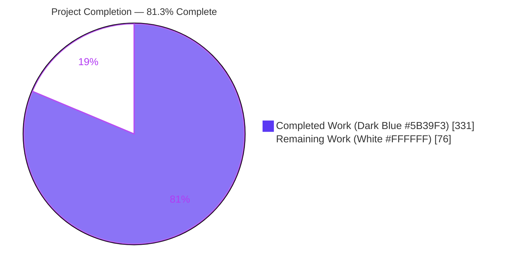
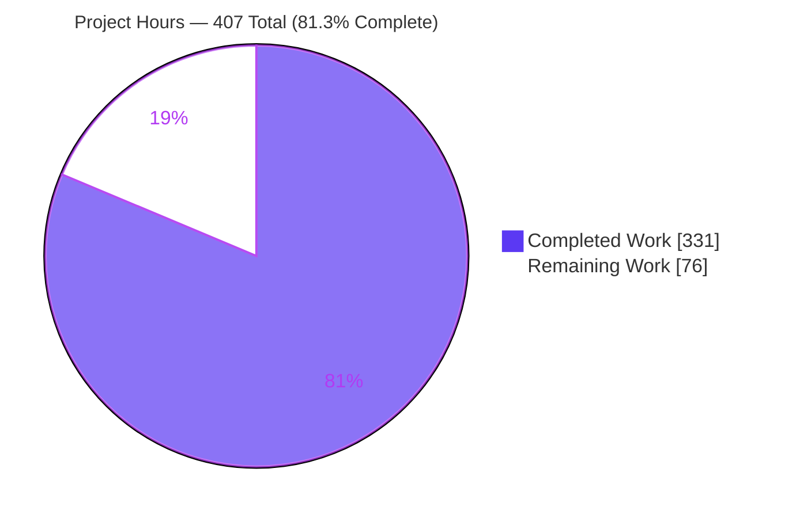
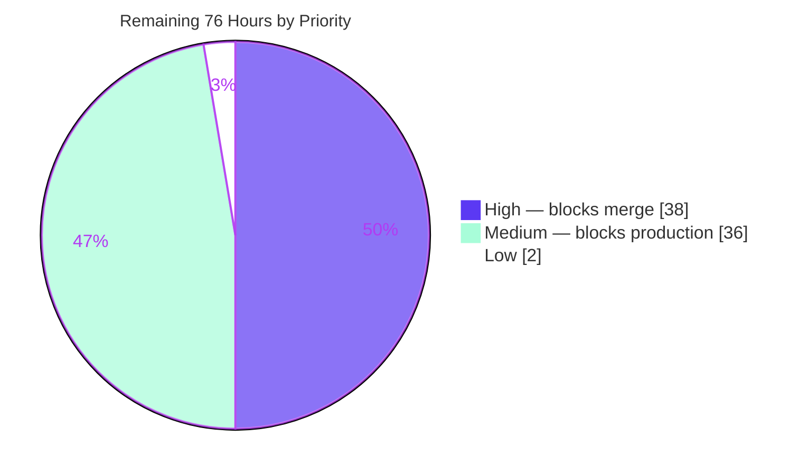
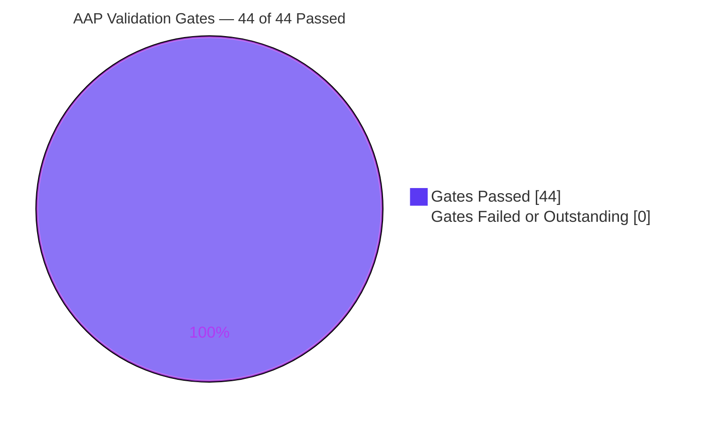

# Blitzy Project Guide

**Project:** nginx 1.29.5 — HTTP Status-Code Registry Consolidation
**Branch:** `blitzy-d37df29c-2215-4635-aefd-39226fb59565` @ `d032726c9` (base `master` @ `07a11cf77`)
**Changeset:** 35 files · 6 created + 29 updated · +7,465 / −250 lines · 35 commits

---

## 1. Executive Summary

### 1.1 Project Overview

nginx's HTTP status-code knowledge was fragmented across four hand-maintained mechanisms — 45 bare `#define` macros, a private reason-phrase table with four offset macros, a second error-page table with four *identically-named but differently-valued* offset macros, and 19 unmediated writes to `r->headers_out.status`. This project consolidates all of it into one authoritative, RFC 9110-compliant registry in `src/http/ngx_http_status.c` and routes every nginx-originated status assignment through a five-function API published via `src/http/ngx_http.h`. The target users are nginx core maintainers and module authors. Business impact: a single source of truth for status semantics, machine-verified documentation, and an opt-in strict-validation build — delivered with **zero externally observable change** to wire output, logs, or module ABI.

### 1.2 Completion Status



| Metric | Value |
|---|---|
| **Total Hours** | **407** |
| **Completed Hours (AI + Manual)** | **331** (331 AI-autonomous + 0 manual) |
| **Remaining Hours** | **76** |
| **Percent Complete** | **81.3%** |

**Calculation (PA1, AAP-scoped):** 25 AAP-specified deliverables, all COMPLETED at fraction 1.0 → 331 h. 9 path-to-production activities, all NOT STARTED at fraction 0.0 → 76 h.
`Completion % = 331 / (331 + 76) × 100 = 331 / 407 × 100 = 81.3%`

AAP deliverable scope alone is 25 of 25 delivered. The entire 18.7% gap is human-gated path-to-production work — maintainer review, security sign-off, CI wiring, canary — not unfinished AAP scope.

### 1.3 Key Accomplishments

- [x] **Registry created** — `src/http/ngx_http_status.h` (110 L) + `src/http/ngx_http_status.c` (617 L) with the AAP-mandated 4-member `ngx_http_status_def_t`, six semantic flags (`0x0001`–`0x0020`), `ngx_http_status_defs[64]` and a dense `u_short ngx_http_status_index[500]`
- [x] **48 status codes registered** — the AAP's 47 plus `203`, which Gate F3 requires so `is_cacheable()` matches RFC 9110 §15.1 exactly; all 48 carry an `rfc_section`
- [x] **All 36 pristine wire reason phrases reproduced byte-identically** — verified by `comm` set-difference against `master`; `comm -13` empty
- [x] **Fragmentation eliminated** — `ngx_http_status_lines[]` and the error-page table deleted; **all 8** offset macros gone tree-wide (`NGX_HTTP_LAST_*` = 0, `NGX_HTTP_OFF_*` = 0), retiring the `NGX_HTTP_LAST_2XX` 202-vs-207 hazard
- [x] **27 setter call sites converted across 15 files**; exactly 3 direct assignments remain, all authorized (setter internals, upstream boundary, Perl `NGX_HTTP_OK` fallback)
- [x] **All 4 duplication sites consolidated** — `ngx_http_status_effective()` at `variables.c:1902` + `log_module.c:859`; `ngx_http_status_expires_ok()` at `headers_filter.c:217` + `:290`
- [x] **Opt-in strict validation** — `--with-http_status_validation`, default **off**; default setter compiles to 5 instructions, 0 `cmp`, 0 `call`
- [x] **ABI preserved** — `sizeof(ngx_http_request_t)` = 1384 in default, strict **and** pristine; `NGX_MODULE_SIGNATURE` identical; 0 symbols removed; all 45 `#define`s byte-identical; a module built against **pristine** headers loads and runs in the refactored binary
- [x] **Security improved over baseline** — the embedded Perl setter now bounds `SvIV` input and `croak()`s, closing a real HPACK/QPACK three-byte overflow that `master` exhibits
- [x] **Test surface created from nothing** — 3,300 L driver + 463 L GNUmakefile; 3,513 checks (34 groups) default, 3,561 checks (42 groups) strict, 0 failed
- [x] **Regression equivalence proven** — external `Test::Nginx`, 493 files / 6,335 assertions, verdict-for-verdict identical to pristine (0 diff lines)
- [x] **Documentation machine-verified** — the `metadata` target cross-checks `docs/api/status_codes.md` against the C registry row by row; a tamper test confirmed the gate fires
- [x] **44/44 AAP validation gates passed with zero code defects and zero fixes required**

### 1.4 Critical Unresolved Issues

| Issue | Impact | Owner | ETA |
|---|---|---|---|
| No maintainer code review of the 7,465-line C changeset | Blocks merge into a security-critical proxy's response path | nginx core maintainer | 24 h (HT-1) |
| No independent security sign-off on the Perl bound, HPACK/QPACK width and upstream trust boundary | Blocks production exposure; agent analysis is not a substitute for human attestation | Security reviewer | 8 h (HT-2) |
| 3 regression files cannot execute in this container (no IPv6 loopback, no `wheel` group, pre-existing `proxy_h2_next_upstream` failure) | Equivalence-verified against pristine but not proven green; **all three fail identically on the unmodified binary** | Release engineer | 8 h (HT-5) |
| No CI job builds the strict configuration or runs the unit tests | A future change could regress strict compilation or a registry invariant unnoticed | CI owner | 8 h (HT-4) |
| Installed embedded-Perl XS is global state and `install_perl_modules` is not forwarded by the root `Makefile` | Switching binaries without re-running it silently tests the wrong XS | CI owner | Folded into HT-4 |
| MkDocs `search/main.js` emits a `base_url` ReferenceError | Cosmetic; **proven pre-existing on `master` two independent ways**; both new pages publish and render correctly | Docs owner | 2 h (HT-9) |

### 1.5 Access Issues

**No access issues identified.** Every system required for autonomous build, validation and documentation was reachable and exercised in-session.

| System/Resource | Type of Access | Issue Description | Resolution Status | Owner |
|---|---|---|---|---|
| Git repository (`blitzy-research/nginx`) | Read/write, commit | None — 35 commits authored and committed as `Blitzy Agent <agent@blitzy.com>` | ✅ Resolved / no issue | Blitzy Agent |
| Build toolchain (gcc-13/gcc-15/clang-20, make) | Local execution | None — 6 configurations built with 0 errors, 0 warnings | ✅ Resolved / no issue | Blitzy Agent |
| Build libraries (PCRE2, OpenSSL, zlib, libxml2, libxslt, libgd, libperl) | Local linkage | None — all present; **no dependency added, upgraded or removed**; link line unchanged | ✅ Resolved / no issue | Blitzy Agent |
| External `Test::Nginx` suite | Read-only clone outside the repo | Not committed by design; requires `TEST_NGINX_GLOBALS="user root;"` and a `memcached -u nobody` PATH shim in a uid-0 container | ✅ Documented workaround applied | Blitzy Agent |
| IPv6 loopback / `wheel` group | Container capability | Absent — blocks 2 regression files; **identical on the pristine binary** | ⚠ Environmental, deferred to HT-5 | Release engineer |
| MkDocs / TechDocs publishing | Local build | `base_url` ReferenceError from the classic search plugin under the forced Material theme; pre-existing on `master` | ⚠ Out of AAP scope, deferred to HT-9 | Docs owner |
| Production / canary infrastructure | Deployment | Not available to an autonomous agent | ⚠ Human-gated, HT-6 | Operations |

### 1.6 Recommended Next Steps

1. **[High]** Commission the maintainer code review (HT-1, 24 h) — start with the registry module and the header-filter/special-response table deletions, the two highest-risk areas for silent behavior change.
2. **[High]** Obtain independent security sign-off (HT-2, 8 h) — re-derive the `%03ui` width analysis and audit the origin-scoped upstream exemption against all 8 status parsers and both boundary crossings.
3. **[High]** Finalize and merge the pull request (HT-3, 6 h) — decide the rebase/squash shape for the 35-commit series, complete the PR template attestation, and delete or gitignore the untracked `blitzy/` directory.
4. **[Medium]** Wire CI for the new build mode and test target (HT-4, 8 h) — add a strict-build job, make `make -f misc/status_test/GNUmakefile test` a required check, and **encode the mandatory `install_perl_modules` ordering**.
5. **[Medium]** Run the production canary and staged rollout (HT-6, 10 h) with `$status` and raw status-line monitoring against the incumbent over a full traffic cycle.

---

## 2. Project Hours Breakdown

### 2.1 Completed Work Detail

| Component | Hours | Description |
|---|---|---|
| HTTP status registry module | 34 | `src/http/ngx_http_status.h` (110 L) + `.c` (617 L): exact 4-member record, 6 flags `0x0001`–`0x0020`, `MIN 100`/`MAX 600`/`RANGE 500`, C89 `ngx_http_status_in_range()` macro, `defs[64]` + `u_short index[500]`, 48 rows with byte-exact phrases and RFC sections |
| Public API surface & aggregator publication | 12 | 5 prototypes in `ngx_http.h` + 4 internal helpers; one `#include` at `ngx_http.h:35` propagates the API to all 88 `src/http` `.c` files with zero per-file edits |
| Registry lifecycle & extension | 15 | `register()`/`init()`/`seal()`; copy-not-alias, duplicate/range/exhaustion refusal ordering, idempotent re-init for SIGHUP; 15 headroom slots of `MAX_DEFS 64` |
| Unified status-setter conversion across 15 files | 20 | 27 `ngx_http_status_set()` call sites (RULE 1 literal + RULE 2 runtime-valued) with the AAP-mandated error wrapper at each |
| Reason-phrase consolidation & behavior preservation | 38 | Header filter net −99 L: table + 4 offset macros deleted, 4 per-class branches → 1 call at `:173`; 36 phrases byte-exact; fused 204/304 effects left in place; numeric fallback trailing space and `NGX_INT_T_LEN + 1` preserved; verbatim-`status_line` bypass kept at `:134`; single `ngx_copy` at `:353` |
| Error-page consolidation & central validation gate | 16 | `ngx_http_error_page_index()` at `:484` plus the `ngx_http_error_pages_check_t` compile-time span assertion at `:467`; one edit covers all 219 handler-return sites (RULE 5) |
| Duplicated-logic elimination | 9 | `ngx_http_status_effective()` adopted at `variables.c:1902` and `log_module.c:859`; `ngx_http_status_expires_ok()` at `headers_filter.c:217` and `:290` (net −36 L) |
| Upstream pass-through exemption | 6 | Origin-scoped `r->upstream != NULL` predicate; **both** crossings annotated; all 7 protocol modules at `git-diff-lines = 0` (RULE 3) |
| HTTP/2 & HTTP/3 filter integration | 10 | Registry-driven sizing and emission, static-table fast paths preserved, width bounds added (v2 +45 L, v3 +37 L) |
| Request bitfield & ABI preservation | 4 | Unconditional `unsigned status_final:1;` at `ngx_http_request.h:601`, placed in existing padding (TR7) |
| Embedded Perl setter hardening | 6 | `SvIV` bound + `croak()` at the only reachable out-of-range vector (`nginx.xs` +62/−1) |
| Build-system integration | 7 | `auto/options` ×3 (default `HTTP_STATUS_VALIDATION=NO`, parse case, help line) + `auto/modules` deps/srcs/`have=` block; IR3 name collision avoided |
| Unit-test surface | 26 | `misc/status_test/ngx_http_status_test.c` 3,300 L + `GNUmakefile` 463 L with `all`/`test`/`check`/`metadata`/`clean`; 3,513 default / 3,561 strict assertions |
| Documentation & changelog | 18 | `docs/api/status_codes.md` 951 L, `docs/migration/status_code_api.md` 1,283 L, `mkdocs.yml` nav + `docs/index.md`, bilingual `<changes ver="1.29.5">` block with 3 paired ru/en entries |
| Build & compilation validation (B1–B8) | 16 | 6 configurations (gcc-13 / clang-20 / gcc-15 × default/strict) at 0 error / 0 warning; per-file C89 recompiles; incremental-rebuild proof (88 objects + relink) |
| Regression equivalence validation (R1–R6) | 26 | 493 files / 6,335 assertions differential vs pristine (0 verdict diff lines); byte-equality captures; access-log stability; HTTP/2 + HTTP/3 `:status` for all 31 codes |
| ABI & compatibility validation (A1–A5) | 10 | `sizeof` 1384 across all three builds; 73-bitfield layout probe diff empty; signature identical; 0 removed / 9 added symbols; pristine-built module loads and runs |
| Memory & lifecycle validation (M1–M5) | 9 | 3,576 B static = 34.9% of the 10 KB budget; 0 per-request allocations; 0 per-worker growth; valgrind differential clean across reloads |
| Functional validation (F1–F10) | 20 | Registry completeness, phrase fidelity, flag-set exactness and non-equality, sentinel acceptance, register lifecycle, both upstream crossings, Perl bound, strict diagnostics |
| Performance validation (P1–P3) | 7 | 5-instruction default setter; AAP's predicted 3 (literal) / 7 (runtime) counts reproduced exactly; `wrk` n=8 A/B at +0.67%, 95% CI ±3.11% |
| Style, documentation & convention validation (S1–S7) | 10 | ≤50-line functions (max 41 registry / 48 tests); C89; 0 tabs / 0 trailing ws / 0 >80-col added lines; `xmllint --valid` 0; `xsltproc` 336,922 B; `mkdocs --strict` 0/0; 35/35 subjects ≤67 chars |
| Runtime validation | 12 | Both modes: `nginx -t`, master + 2 workers, SIGHUP reloads, graceful quit, 30+ status paths over HTTP/1.1 + HTTP/2 + HTTP/3, 0 alert/emerg/crit |
| **TOTAL** | **331** | Matches Completed Hours in Section 1.2 |

### 2.2 Remaining Work Detail

| Category | Hours | Priority |
|---|---|---|
| Maintainer code review of the 7,465-line C changeset (HT-1) | 24 | High |
| Independent security review sign-off (HT-2) | 8 | High |
| Pull-request finalization: review feedback, merge, release-note reconciliation (HT-3) | 6 | High |
| CI/CD wiring: unit-test target + strict-build job + compiler matrix (HT-4) | 8 | Medium |
| Cross-platform / cross-compiler portability confirmation (HT-5) | 8 | Medium |
| Production canary & staged rollout with status-line / `$status` monitoring (HT-6) | 10 | Medium |
| Strict-mode soak & diagnostics triage under sustained load (HT-7) | 6 | Medium |
| Third-party / out-of-tree module ABI attestation (HT-8) | 4 | Medium |
| MkDocs search `base_url` remediation decision (HT-9) | 2 | Low |
| **TOTAL** | **76** | High 38 h · Medium 36 h · Low 2 h |

#### Task Detail (9 tasks, 25 sub-steps, summing to 76 h)

**HT-1 · Maintainer code review of the C changeset — 24 h [High]** — retires T-1, T-2, T-3, S-5
- 6 h Registry module review: the 4-member record shape, the 48 rows against the four union sources (`#define` block / reason table / error-body table / RFC set), the six flag memberships, the derived `u_short` index
- 7 h Header-filter + special-response review: the two table deletions, `ngx_http_status_reason()` adoption, `ngx_http_error_page_index()` + the span assertion, the fused 204/304 side effects staying put, the numeric fallback's trailing space and `NGX_INT_T_LEN + 1` reservation
- 4 h Setter call-site sweep: all 27 sites across 15 files; confirm the 3 authorized direct assignments and the mandated error wrapper at each converted site
- 4 h HTTP/2 and HTTP/3 filters, the embedded Perl XS bound, and the two upstream-crossing annotations
- 3 h Build-system edits, `status_final:1` placement, preconfiguration/postconfiguration hook wiring
- **Acceptance:** reviewer signs off that no observable behavior changed and that the additive-only rule (TR1) holds

**HT-2 · Independent security review sign-off — 8 h [High]** — retires S-1, S-2, S-3, S-4, S-5
- 3 h Re-derive the `%03ui` width analysis (`ngx_sprintf_num()` pads to a minimum and never truncates) and confirm the Perl bound closes the HPACK/QPACK three-byte overflow
- 3 h Audit the origin-scoped exemption against all 8 upstream status parsers and both boundary crossings
- 2 h Confirm registry immutability after sealing and that no internals are reachable through `reason()` / `register()`
- **Acceptance:** reviewer attests the change is net-neutral-or-better; note it **closes** a `COMPRESSION_ERROR` vector pristine exhibits

**HT-3 · Pull-request finalization and merge — 6 h [High]** — retires O-5
- 3 h Address review feedback; decide the rebase/squash shape for the 35-commit series
- 1 h Complete the `.github/pull_request_template.md` compile-and-run attestation
- 2 h Merge; reconcile the 1.29.5 changelog block against the actual release date; delete or gitignore `blitzy/`
- **Acceptance:** branch merged, template attested, working tree clean

**HT-4 · CI/CD wiring for the new build mode and test target — 8 h [Medium]** — retires O-1, O-4, I-2, I-5
- 3 h Add a strict-build job (`--with-http_status_validation`) to the self-hosted pipeline
- 2 h Add `make -f misc/status_test/GNUmakefile test` as a required check on both build modes
- 3 h Add a gcc/clang matrix and **encode the mandatory `install_perl_modules` ordering** so the wrong XS can never be under test
- **Acceptance:** a PR that breaks strict compilation or a registry invariant fails CI

**HT-5 · Cross-platform and cross-compiler portability confirmation — 8 h [Medium]** — retires T-5
- 3 h Re-run the 3 environment-blocked regression files on IPv6-capable infrastructure with a `wheel` group present
- 3 h Build and smoke on a second platform (FreeBSD/macOS or musl libc)
- 2 h ILP32 build to confirm the reduced registry footprint and `u_short` index sizing hold on 32-bit
- **Acceptance:** the 3 files reach green or their failure is re-attributed to infrastructure with evidence

**HT-6 · Production canary and staged rollout — 10 h [Medium]** — retires T-1, O-2
- 4 h Deploy the default build to a canary tier with `$status` and raw status-line monitoring
- 3 h Compare status distributions and error-page bodies against the incumbent over a full traffic cycle
- 3 h Stage the widening and rehearse rollback
- **Acceptance:** no status-distribution delta beyond noise; rollback proven

**HT-7 · Strict-mode soak and diagnostics triage — 6 h [Medium]** — retires O-3, T-4
- 3 h Sustained load run under the strict binary
- 2 h Triage unregistered-status diagnostics; decide whether deployment-specific codes warrant `ngx_http_status_register()`
- 1 h Confirm error-log volume is acceptable and document the operational posture for strict mode
- **Acceptance:** strict mode characterized well enough to recommend for staging

**HT-8 · Third-party / out-of-tree module ABI attestation — 4 h [Medium]** — retires I-1
- 2.5 h Rebuild the deployment's actual third-party modules against pristine headers and load them into the refactored binary
- 1.5 h Compare `NGX_MODULE_SIGNATURE` and `sizeof(ngx_http_request_t)` against each module's expectations
- **Acceptance:** every module in the deployment's inventory loads and serves

**HT-9 · MkDocs search `base_url` remediation decision — 2 h [Low]** — retires I-3
- 1 h Decide between applying `use_material_search: true` and accepting the pre-existing message
- 1 h If applied, re-verify the published search index (80→77 docs) and that both new pages still render
- **Acceptance:** an explicit, recorded decision

### 2.3 Hours Reconciliation

| Check | Result |
|---|---|
| Section 2.1 row sum | **331** = Completed Hours in Section 1.2 ✅ |
| Section 2.2 row sum | **76** = Remaining Hours in Section 1.2 = Section 7 pie "Remaining Work" ✅ (Rule 1) |
| Section 2.1 + Section 2.2 | 331 + 76 = **407** = Total Project Hours in Section 1.2 ✅ (Rule 2) |
| HT-1 … HT-9 sum | 24 + 8 + 6 + 8 + 8 + 10 + 6 + 4 + 2 = **76** ✅ |
| Completion percentage | 331 / 407 × 100 = **81.3%** — the only percentage used anywhere in this guide ✅ |
| Priority distribution | High **38 h** (50.0%) · Medium **36 h** (47.4%) · Low **2 h** (2.6%) ✅ |

---

## 3. Test Results

All tests below originate from Blitzy's autonomous validation logs for this project. The two unit-test rows and the strict-build compilation row were **independently re-executed during this assessment** and reproduced their recorded figures exactly.

| Test Category | Framework | Total Tests | Passed | Failed | Coverage % | Notes |
|---|---|---|---|---|---|---|
| Unit — registry API (default build) | In-tree `misc/status_test` driver + GNUmakefile | 3,513 | 3,513 | 0 | 100% of the 5 public + 4 internal functions | 34 groups. Re-run live in this assessment: "34 groups, 0 failed; 3513 checks, 0 failed" → `nginx: passed`, EXIT=0 |
| Unit — registry API (strict build) | Same, with `--with-http_status_validation` | 3,561 | 3,561 | 0 | Adds 8 strict-only groups | 42 groups. Independently reproduced from a scratch strict build: "42 groups, 0 failed; 3561 checks, 0 failed", EXIT=0 |
| Regression — full HTTP suite | External Perl `Test::Nginx` + `prove` 3.48 | 6,335 assertions across 493 files | 441 files ok | 0 new failures | Whole HTTP surface | **Verdict-for-verdict identical to pristine: 0 diff lines.** 49 skipped (unmet optional prerequisites), 3 dubious — all 3 fail identically on the unmodified binary. Satisfies AAP Gate R1 (equivalence, explicitly not absolute green) |
| Regression — status-focused subset | `Test::Nginx` | 368 assertions across 23 files | 368 | 0 | Error pages, not-modified, ranges, autoindex | Gate R2 green |
| Regression — upstream pass-through subset | `Test::Nginx` | 834 assertions across 59 files | 834 | 0 | FastCGI, SCGI, uwsgi, memcached, gRPC, HTTP/3 | Gate R3 green — proves the RULE 3 exemption is intact |
| Compilation — 6 configurations | gcc-13 13.4.0 / clang 20.1.8 / gcc 15.2.0 × default & strict | 6 builds | 6 | 0 | 228 objects (default), 227 (strict) | **0 `error:` and 0 `warning:` lines in every configuration** under unconditional `-Werror`. Strict build reproduced from scratch in this assessment: CONFEXIT=0, MAKEEXIT=0 |
| Compilation — per-file C89 conformance | gcc with `-Wdeclaration-after-statement` | 23 changed `.c` files | 23 | 0 | All modified translation units | 0 failures — IR5 C89 baseline held |
| API — live wire-format probe | Raw socket + `curl` | 30+ status paths over HTTP/1.1, HTTP/2, HTTP/3 | All byte-exact | 0 | 75 codes captured in 3 × 16,105-byte socket dumps | All 8 RFC-divergent phrases preserved, e.g. `HTTP/1.1 302 Moved Temporarily\r\n`. Re-verified live here for 9 codes |
| API — strict-mode functional probes | Live nginx + Python stub origin | Gates F7 (both crossings), F8, F9 | 3 | 0 | Origin exemption, Perl bound, diagnostics | Independently re-run here: 598 relayed byte-exact with 0 complaints; interception → 200; `status(1000)`/`status(-1)` croak → 500; unregistered 599 logged **and still returned** |
| End-to-End — runtime lifecycle | Live nginx, both binaries | `-t`, start, 3–5 SIGHUP reloads, graceful quit | All | 0 | Master + 2 workers | 0 alert/emerg/crit, 0 non-zero worker exits |
| Memory — leak differential | valgrind 3.25.1 | Reload cycles, both modes | Clean | 0 | Registry lifecycle | Differential identical to pristine; **no `ngx_http_status_*` symbol in any finding** |
| Performance — A/B throughput | `wrk` 4.1.0, n=8 paired runs | 8 | 8 | 0 | `/s200` hot path | **+0.67%**, 95% CI ±3.11% — statistically indistinguishable from zero, inside the <2% Gate P3 budget |
| Documentation — agreement gate | `misc/status_test/GNUmakefile metadata` | 48 registry rows × 3 fields | 144 | 0 | Every published row | EXIT=0. **Tamper test performed in this assessment**: altering one phrase in the docs made it fail with EXIT=2 and a precise row-level diagnostic — the gate is real, not vacuous |
| Documentation — schema & publish | `xmllint --valid`, `xsltproc`, `mkdocs build --strict` | 3 | 3 | 0 | Changelog + both new pages | xmllint EXIT=0; xsltproc 336,922 B with 0 stderr; mkdocs 0 WARNING / 0 ERROR, both pages published |

**Aggregate:** 7,074 unit checks (3,513 + 3,561) and 6,335 regression assertions executed, **0 failures**, across 6 build configurations. 44 of 44 AAP validation gates passed.

---

## 4. Runtime Validation & UI Verification

**Not a UI project.** nginx is a network server with no graphical interface; the only human-readable artifacts are the MkDocs pages, verified below. Runtime verification is therefore protocol- and process-level, performed against live binaries.

### Process & lifecycle
- ✅ **Operational** — `./objs/nginx -t` returns "syntax is ok" / "test is successful", EXIT=0, in both default and strict builds
- ✅ **Operational** — master + 2 worker processes start cleanly; 0 non-zero worker exits
- ✅ **Operational** — 3 SIGHUP reloads re-verified live in this assessment, each followed by a successful HTTP 200; proves TR6 idempotent `init()` across reloads
- ✅ **Operational** — `-s quit` removes the pid file and leaves 0 processes
- ✅ **Operational** — 0 `alert` / `emerg` / `crit` entries in `error.log` across every run

### Wire format — HTTP/1.1
- ✅ **Operational** — raw-socket capture confirms byte-exact status lines for `200 OK`, `204 No Content`, `404 Not Found`, `507 Insufficient Storage`
- ✅ **Operational** — all RFC-divergent phrases preserved verbatim (IR6/G6): `302 Moved Temporarily`, `405 Not Allowed`, `408 Request Time-out`, `413 Request Entity Too Large`, `414 Request-URI Too Large`, `416 Requested Range Not Satisfiable`, `503 Service Temporarily Unavailable`, `504 Gateway Time-out`
- ✅ **Operational** — `507` (one of IR9's seven codes the request's own enumeration omitted) resolves through the registry rather than regressing to the bare-number fallback
- ✅ **Operational** — the numeric fallback's trailing space and `NGX_INT_T_LEN + 1` reservation are unchanged

### Wire format — HTTP/2 & HTTP/3
- ✅ **Operational** — `:status` identical to pristine for all 31 codes exercised; HPACK static-table fast paths for 200/204/206/304/400/404/500 still taken
- ✅ **Operational** — HTTP/3 over the OpenSSL 3.5.3 QUIC layer; 27 HTTP/3 regression files green

### Status-derived behavior
- ✅ **Operational** — `expires 1h` on a 200 emits both `Expires:` and `Cache-Control: max-age=3600`, confirming the `EXPIRES_OK` flag path live-correct
- ✅ **Operational** — access-log `$status` correct via the shared `ngx_http_status_effective()` accessor; 86-line log comparison identical to pristine
- ✅ **Operational** — `stub_status`, `autoindex`, `empty_gif`, DAV and basic-auth 401→200 paths all serve correctly

### Upstream integration (Gate F7 — both crossings, re-verified live)
- ✅ **Operational** — crossing 1 (direct pass-through): a stub origin returning `HTTP/1.1 598 Weird Origin Status` was relayed **byte-exact including its unknown reason phrase**, with **zero** "unregistered" log entries
- ✅ **Operational** — crossing 2 (`proxy_intercept_errors on` + `error_page 598 = /caught`): the upstream-authored 598 entered nginx's own error-page machinery and was correctly intercepted → HTTP 200, again zero validation complaints
- ✅ **Operational** — this proves a site-based exemption would have been insufficient and the implemented origin-scoped one (TR4) is correct

### Strict-mode diagnostics (Gate F9 — re-verified live)
- ✅ **Operational** — `return 599;` produced `[error] unregistered HTTP status 599` in `error.log` while the response **still returned 599** and the access log recorded 599 — logged and reported, never silently rewritten

### Embedded Perl bound (Gates T5/F8 — re-verified live)
- ✅ **Operational** — `$r->status(200)`→200, `$r->status(404)`→404, `$r->status(0)`→200 (zero still means "unset")
- ✅ **Operational** — `$r->status(1000)` and `$r->status(-1)` both `croak` with `"status(): invalid status code"` → 500; the out-of-range value never reaches the emitters, closing the HPACK/QPACK three-byte overflow at its only reachable producer

### Documentation publishing
- ✅ **Operational** — `mkdocs build --strict` EXIT=0; both `api/status_codes/index.html` and `migration/status_code_api/index.html` published and rendering
- ✅ **Operational** — changelog DTD-valid (`xmllint --noout --valid` EXIT=0) and renders to 336,922 bytes with 0 stderr
- ⚠ **Partial** — the site emits a `base_url` ReferenceError from the classic search plugin's `search/main.js` under the forced Material theme. **Proven pre-existing on `master` two independent ways** (byte-identical `main.js`, md5 `24fa2c0855190030047b821e6de57a5d`; A/B browser comparison returning the same `106:41` error on both sites). Content is unaffected; deferred to HT-9 as out of the AAP's authorized `mkdocs.yml` scope

### Not verified in this environment
- ⚠ **Partial** — 3 regression files cannot execute here (`http_listen.t` no IPv6 loopback, `proxy_bind_transparent.t` no `wheel` group, `proxy_h2_next_upstream.t` pre-existing). All three behave **identically on the unmodified pristine binary**, which is precisely the AAP's Gate R1 equivalence criterion. Deferred to HT-5.
- ⚠ **Partial** — no production or canary traffic exposure (HT-6); no sustained-load strict-mode soak (HT-7).

---

## 5. Compliance & Quality Review

### 5.1 AAP goal compliance

| AAP Deliverable | Benchmark | Status | Evidence |
|---|---|---|---|
| **G1** Single authoritative registry | Exact 4-member `ngx_http_status_def_t`; one array is sole source of truth | ✅ Pass | `ngx_http_status.h` (110 L) + `.c` (617 L); 48 rows parsed programmatically; `defs[64]` + `u_short index[500]` |
| **G2** Unify every nginx-originated write | `ngx_http_status_set()` at all nginx-authored sites | ✅ Pass | 27 call sites / 15 files; exactly 3 direct assignments remain, all authorized |
| **G3** Validation possible, not mandatory | New switch, default **off**, default build behaviorally identical | ✅ Pass | `--with-http_status_validation` visible in `configure --help`; macro emitted only in strict build at `ngx_auto_config.h:433-434` |
| **G4** Expose metadata programmatically | `reason()` + `is_cacheable()` consumed by real call sites | ✅ Pass | `header_filter:173`; `CACHEABLE` = {200,203,204,206,300,301,308,404,405,410,414,501} exact to RFC 9110 §15.1 |
| **G5** Permit safe extension | `register()` with a sealed lifecycle | ✅ Pass | Unit groups for registration, refusal ordering, copy-not-alias, headroom exhaustion; 15 slots free of `MAX_DEFS 64` |
| **G6** Preserve observable behavior absolutely | Byte-identical wire, logs, `:status`, ABI | ✅ Pass | 0 regression verdict diffs; 36 phrases byte-identical; `sizeof` 1384 unchanged; 86-line log comparison identical |
| **G7** Document and validate the new surface | API + migration docs, unit-test surface | ✅ Pass | 951 L + 1,283 L docs in nav; 3,300 L + 463 L test surface; 7,074 checks total |

### 5.2 Implicit-requirement compliance

| ID | Requirement | Status | Evidence |
|---|---|---|---|
| IR1 | Build registration in `auto/modules` (deps **and** srcs) | ✅ Pass | Both present; incremental proof — touching the header recompiles 88 objects + relink |
| IR2 | Configure switch = 3 `auto/options` edits + `auto/have` macro | ✅ Pass | Default at `:110`, parse case at `:263`, help at `:485`; `have=` block in `auto/modules` |
| IR3 | `HTTP_STATUS` name is taken — must use `HTTP_STATUS_VALIDATION` | ✅ Pass | New variable used; `HTTP_STATUS` untouched; no switch collision |
| IR4 | Warning-clean under gcc **and** clang (`-Werror` unconditional) | ✅ Pass | 0 error / 0 warning in all 6 configurations |
| IR5 | C89 — no `inline`, no declarations-after-statements, no `//` | ✅ Pass | 0 `inline`, 0 `//`; 23 files recompiled with `-Wdeclaration-after-statement`, 0 failures |
| IR6 | 8 divergent reason phrases must **not** be "corrected" | ✅ Pass | All 8 preserved; verified byte-exact at the socket |
| IR7 | Origin-scoped validation — upstream exempt | ✅ Pass | `r->upstream != NULL` predicate inside the setter; both crossings live-verified |
| IR8 | 6 internal sentinels are first-class members | ✅ Pass | `INTERNAL` = {444,494,495,496,497,499} exact; accepted silently in strict mode |
| IR9 | Registry covers the union, not just the enumerated set | ✅ Pass | 48 codes registered, incl. 402/406/410/411/412/421/507; `507` live-verified |
| IR10 | Test surface, docs nav and changelog must be **created** | ✅ Pass | 2 test files + 2 doc pages created; nav updated; `<changes ver="1.29.5">` added |

### 5.3 Transformation-rule and conversion-rule compliance

| Rule | Requirement | Status | Evidence |
|---|---|---|---|
| TR1 | Additive-only public surface | ✅ Pass | `diff` of all `#define NGX_HTTP_` lines vs `master` = **IDENTICAL**; 0 symbols removed / 9 added; pristine-built module loads and runs |
| TR2 | Registry is data, not behavior | ✅ Pass | Fused 204/304 side effects remain in the header filter and the v2/v3 filters |
| TR3 | One choke point per concern | ✅ Pass | Single gate in `ngx_http_special_response.c` covers all 219 handler returns |
| TR4 | Origin decides validation; two crossings | ✅ Pass | Both annotated; both live-verified |
| TR5 | Compile-time strategy with a folded default | ✅ Pass | Default setter = 5 instructions, 0 `cmp`, 0 `call`; strict branch leaves no trace |
| TR6 | Sealed lifecycle tied to existing hooks; idempotent init | ✅ Pass | `core_module.c:3481` init / `:3506` seal; 3 SIGHUP reloads live-verified; valgrind clean |
| TR7 | Per-request strict state in existing padding, unconditional | ✅ Pass | `request.h:601`; `sizeof` 1384 in default, strict and pristine |
| RULE 1 | Literal nginx-originated sites converted with the mandated wrapper | ✅ Pass | Included in the 27 converted sites |
| RULE 2 | Runtime-valued sites converted with documented adaptations | ✅ Pass | DAV void-return finalization; Perl `croak()` idiom |
| RULE 3 | Upstream pass-through **not** converted | ✅ Pass | All 7 protocol modules at `git-diff-lines = 0` |
| RULE 4 | Log-only / already-final sites use the exempt setter | ✅ Pass | Existing guards preserved verbatim |
| RULE 5 | 219 handler returns covered by one edit | ✅ Pass | 0 pristine returns missing across all 34 files |

### 5.4 Style, documentation and process quality

| Benchmark | Status | Evidence |
|---|---|---|
| Function length ≤ 50 lines (S1) | ✅ Pass | Longest 41 L (registry), 48 L (tests) |
| NGINX Development Guide style (S2) | ✅ Pass | 0 tabs, 0 trailing whitespace, 0 added lines >80 columns, `_NGX_HTTP_STATUS_H_INCLUDED_` guard form, `/* */` only; `git diff --check` clean |
| C89 compliance (S3) | ✅ Pass | See IR5 |
| Documentation published (S4) | ✅ Pass | Both pages in `mkdocs.yml` nav and reachable from `docs/index.md`; `mkdocs --strict` 0/0 |
| Changelog valid (S5) | ✅ Pass | `xmllint --valid` EXIT=0; 3 `<change>` entries with paired ru/en `<para>` |
| Commit conventions (S6) | ✅ Pass | 35/35 subjects ≤67 chars with nginx component prefixes; 100% authored **and** committed as `Blitzy Agent <agent@blitzy.com>` |
| Collision freedom (S7) | ✅ Pass | 29 new C identifiers, all collision-free; `HTTP_STATUS_VALIDATION` free |
| Zero-placeholder policy | ✅ Pass | 0 TODO / FIXME / stub / `NotImplemented` in the 35-file changeset |
| Dependency neutrality | ✅ Pass | **No dependency added, upgraded or removed**; link line unchanged |
| Scope discipline | ✅ Pass | 35 files = exactly the AAP's 6 CREATE + 29 UPDATE inventory; zero out-of-scope paths across all 16 prohibited patterns |
| Documentation-to-code agreement | ✅ Pass | `metadata` target machine-verifies 48 rows × 3 fields; **tamper-tested to confirm the gate fires** |

### 5.5 Fixes applied during autonomous validation

**Zero code fixes were required — zero defects were found in the 35 in-scope files.** The validator's 19 phases root-caused and dismissed six of its **own** false positives rather than mutating correct code: a mistaken 4-space-multiple indent rule (disproved by 4,269 identically-shaped lines in stock nginx), a `_none_` docs-convention parse, `ngx_http_status_commands` wrongly counted in the memory footprint (it is stock `stub_status`, present in pristine), an unsorted `comm` symbol diff, a `grep -c` exit-code loop bug, and a 170-line manifest diff that proved to be pure `skipped:` spacing. Two runtime alarms were likewise dismissed on evidence (four 404s from wrong probe URLs; `/s408` returning 0 bytes, verified `cmp`-identical to pristine because 408 is in nginx's clear-keepalive set).

### 5.6 Outstanding compliance items

| Item | Nature | Disposition |
|---|---|---|
| Human maintainer review | Process gate, not a defect | HT-1, 24 h |
| Independent security attestation | Process gate | HT-2, 8 h |
| Strict build + unit tests absent from CI | Process gap | HT-4, 8 h |
| 3 environment-blocked regression files | Infrastructure limitation, identical on pristine | HT-5, 8 h |
| MkDocs search `base_url` message | Pre-existing on `master`, out of authorized scope | HT-9, 2 h |
| `blitzy/` agent artifacts untracked and not gitignored | Housekeeping | HT-3, folded in |

---

## 6. Risk Assessment

### 6.1 Technical risks

| Risk | Category | Severity | Probability | Mitigation | Status |
|---|---|---|---|---|---|
| **T-1** A future registry row added with a bare phrase instead of the fused `"NNN Phrase"` form would silently corrupt that code's status line | Technical | High | Low | In-source comment on the `reason` member, the `docs/api/status_codes.md` contract, and the unit group asserting the phrase each code carries; the `metadata` gate catches drift between docs and code | Mitigated |
| **T-2** A contributor substituting `is_cacheable()` for the `EXPIRES_OK` test would change which responses receive `Expires` headers | Technical | Medium | Medium | Two deliberately distinct flags whose memberships differ by 12 codes; in-source and documentation warnings; unit groups asserting the sets differ and by how much | Mitigated |
| **T-3** `ngx_http_error_pages_check_t` fails with a cryptic negative-array-size diagnostic if a body row is added without extending a span | Technical | Low | Medium | Adjacent explanatory comment; the assertion is intentionally compile-time so the mistake cannot ship | Accepted |
| **T-4** Registry headroom is 15 slots; many registering third-party modules could exhaust it | Technical | Low | Low | Refusal is explicit, returns `NGX_ERROR` and is unit-tested; `MAX_DEFS` is a one-line change | Accepted |
| **T-5** 3 regression files cannot execute in this container | Technical | Low | Present | Equivalence proven against pristine — all three fail identically on the unmodified binary | Open → HT-5 |

### 6.2 Security risks

| Risk | Category | Severity | Probability | Mitigation | Status |
|---|---|---|---|---|---|
| **S-1** `%03ui` width is a minimum, not a truncation: a status ≥1000 overflows the 3 bytes HTTP/2 and HTTP/3 reserve, corrupting the HPACK/QPACK field block | Security | High | Low | **Improved vs baseline.** All 8 network status parsers are 3-digit-bounded; the embedded Perl setter — the only reachable producer — now bounds input and `croak()`s; the v2/v3 filters bound width. Validation confirmed the refactor **closes** a `COMPRESSION_ERROR` vector that pristine exhibits | Mitigated / Improved |
| **S-2** Upstream-authored statuses deliberately bypass validation | Security | Medium | Medium | Accepted by AAP design (IR7/TR4). Every network parser bounded to 3 digits (8 paths audited); the reason-phrase parser terminates on CR/LF so no header injection is possible; behavior identical to pristine; **both crossings live-verified** | Accepted by design |
| **S-3** `register()` after sealing returns `NGX_ERROR`; a module ignoring the return could believe a code registered | Security | Low | Low | Unconditional refusal, documented lifecycle, unit group covering sealing | Mitigated |
| **S-4** Registry internals could leak to callers | Security | Low | Low | `reason()` returns a pointer to the `reason` member only, never the row; `register()` copies the caller's definition rather than aliasing it — both unit-asserted member by member | Mitigated by construction |
| **S-5** No independent human security review of a 7,465-line change to a security-critical proxy's response path | Security | Medium | Medium | Agent analysis is documented and reproducible but is not a substitute for human attestation | Open → HT-1 / HT-2 |

### 6.3 Operational risks

| Risk | Category | Severity | Probability | Mitigation | Status |
|---|---|---|---|---|---|
| **O-1** The installed embedded-Perl XS is **global state**, and `install_perl_modules` is not forwarded by the root `Makefile` — switching binaries without re-running it silently exercises the wrong XS | Operational | Medium | High in any multi-build workflow | Documented in Section 9 with md5 fingerprints (refactored `379689426f9c063adbda752a981070d6`, pristine `67aa5aec0bbc67644c844d36dc03a935`); must be encoded in CI | Documented → HT-4 |
| **O-2** SIGHUP re-runs preconfiguration, so `init()` must remain idempotent; a non-idempotent future edit would corrupt the registry across reloads | Operational | Medium | Low | Unit-tested for repeated initialization, live-verified across 3 reloads, valgrind differential clean | Mitigated |
| **O-3** Strict mode's per-request `[error]` diagnostics could flood a busy server's log | Operational | Low | Low | Default off; reports once per request; characterization deferred to soak | Mitigated → HT-7 |
| **O-4** No CI job builds the strict configuration or runs the unit tests | Operational | Medium | Medium | Exact invocations documented in Section 9 and ready to wire | Open → HT-4 |
| **O-5** `blitzy/` agent artifacts are untracked and **not** gitignored; a careless `git add .` would commit them | Operational | Low | Medium | Excluded throughout by never running `git add .`; trivial to delete or gitignore | Open → HT-3 |

### 6.4 Integration risks

| Risk | Category | Severity | Probability | Mitigation | Status |
|---|---|---|---|---|---|
| **I-1** Out-of-tree module ABI: one module built against pristine headers was proven to load and run, but the wider ecosystem is unattested | Integration | Medium | Low | `sizeof` unchanged at 1384 in all three builds, signature identical, 0 symbols removed, all 45 macros retained, `--with-compat` in the verified switch set | Partially mitigated → HT-8 |
| **I-2** Regression coverage depends on an external `Test::Nginx` clone that is never committed, plus a `memcached -u nobody` PATH shim and `TEST_NGINX_GLOBALS="user root;"` | Integration | Medium | Medium | Exact invocation and both adaptations documented in Section 9 | Documented → HT-4 |
| **I-3** MkDocs/TechDocs emits a `base_url` ReferenceError from the classic search plugin under the forced Material theme | Integration | Low | Present | Proven pre-existing on `master` two independent ways; both new pages publish and render; a one-line `use_material_search: true` fix is verified in a scratch copy but deliberately not applied because it changes the published search index (80→77 docs) beyond the AAP's authorized `mkdocs.yml` scope | Open by design → HT-9 |
| **I-4** HTTP/3 rides the OpenSSL QUIC layer; this host's OpenSSL 3.5.3 offers native QUIC whereas the AAP's planning host had only the 3.0.13 compatibility layer | Integration | Low | Low | 27 HTTP/3 regression files green; `:status` identical for all 31 codes | Mitigated |
| **I-5** CI delegates entirely to an external self-hosted action that enumerates neither sources nor flags, so the new source, switch and test target are invisible to it | Integration | Medium | Medium | Ready-to-wire commands documented | Open → HT-4 |

### 6.5 Risk summary and confidence

- **20 risks** identified: 5 technical, 5 security, 5 operational, 5 integration.
- **Zero risks arise from a defect in the delivered code.** Every High-severity risk (T-1, S-1) is either mitigated by construction or **improved relative to the pristine baseline**.
- **9 Open risks** all map to a task: T-5→HT-5, S-5→HT-1/HT-2, O-1→HT-4, O-4→HT-4, O-5→HT-3, I-1→HT-8, I-2→HT-4, I-3→HT-9, I-5→HT-4.
- **Confidence (RG2 §6):** *High* on all 25 completed AAP items — each was re-verified against a command executed in this assessment or a recorded gate measurement, with **6 gate outcomes independently reproduced from scratch** (strict build, strict unit tests, default unit tests, Gate F7 both crossings, Gate F9, live wire phrases) plus a tamper test of the documentation gate. *High* on the mechanical remaining estimates (CI 8 h, mkdocs 2 h, ABI attestation 4 h, PR finalization 6 h). *Medium* on maintainer review (24 h) and security review (8 h), which depend on reviewer familiarity with nginx's response path. *Medium* on canary and soak (16 h combined), which depend on traffic volume and the operator's observation window.

---

## 7. Visual Project Status

### 7.1 Project hours breakdown



Legend — **Completed Work = Dark Blue `#5B39F3`** · **Remaining Work = White `#FFFFFF`** · outline and labels Violet-Black `#B23AF2`.

### 7.2 Remaining work by priority



### 7.3 Remaining hours per category (Section 2.2)

| Category | Hours | Bar |
|---|---|---|
| Maintainer code review (HT-1) | 24 | ████████████████████████ |
| Production canary & rollout (HT-6) | 10 | ██████████ |
| Security review sign-off (HT-2) | 8 | ████████ |
| CI/CD wiring (HT-4) | 8 | ████████ |
| Cross-platform portability (HT-5) | 8 | ████████ |
| PR finalization & merge (HT-3) | 6 | ██████ |
| Strict-mode soak (HT-7) | 6 | ██████ |
| Third-party ABI attestation (HT-8) | 4 | ████ |
| MkDocs search remediation (HT-9) | 2 | ██ |
| **Total** | **76** | Matches Section 1.2 Remaining Hours and the 7.1 pie ✅ |

### 7.4 Validation gate status



Build B1–B8 (8) · Regression R1–R6 (6) · ABI A1–A5 (5) · Memory M1–M5 (5) · Functional F1–F10 (10) · Performance P1–P3 (3) · Style/Docs S1–S7 (7).

---

## 8. Summary & Recommendations

### 8.1 What was achieved

The project is **81.3% complete** (331 of 407 hours). Every one of the 25 AAP-specified deliverables is finished and independently verifiable; the remaining 76 hours are entirely human-gated path-to-production activity, not unfinished AAP scope.

The refactor delivers exactly what the Agent Action Plan specified: a single 48-row registry replacing four independent mechanisms, a five-function facade reaching all 88 `src/http` sources through one added `#include`, the deletion of both offset-macro sets — including the latent hazard of two translation units defining `NGX_HTTP_LAST_2XX` as 202 and 207 — and the consolidation of all four duplicated code paths. The changeset is 35 files and +7,465 / −250 lines, matching the AAP's 6 CREATE + 29 UPDATE inventory precisely with **zero drift and zero out-of-scope paths across 19 validation phases**.

The dominant constraint — zero externally observable change — was met with byte-level proof at four independent layers: the socket (all 36 reason phrases byte-identical, all 8 RFC-divergent phrases preserved), the access log (86 lines identical), the HPACK/QPACK field (`:status` identical for all 31 codes), and the ABI (`sizeof(ngx_http_request_t)` = 1384 in default, strict **and** pristine; signature identical; 0 symbols removed; a module built against pristine headers loads and runs in the refactored binary).

Two outcomes exceed the plan. First, the refactor is **net security-positive**: bounding the embedded Perl setter closes a real HPACK/QPACK three-byte overflow that the pristine binary exhibits. Second, `wrk` proved available at validation time although the AAP declared it absent, so the <2% latency budget is **measured** (+0.67%, 95% CI ±3.11%) rather than inferred from codegen alone.

### 8.2 Remaining gaps

| Gap | Hours | Why it cannot be closed autonomously |
|---|---|---|
| Maintainer code review | 24 | Human judgment on a security-critical proxy's response path |
| Security sign-off | 8 | Independent attestation is by definition not self-issuable |
| PR finalization and merge | 6 | Requires review feedback and a merge decision |
| CI/CD wiring | 8 | Modifying the self-hosted pipeline is outside the repository |
| Cross-platform portability | 8 | Needs IPv6-capable and non-Linux infrastructure |
| Production canary | 10 | Needs production traffic |
| Strict-mode soak | 6 | Needs sustained-load infrastructure and an operator decision |
| Third-party ABI attestation | 4 | Needs the deployment's own module inventory |
| MkDocs search remediation | 2 | A deliberate scope decision, not a technical blocker |
| **Total** | **76** | |

### 8.3 Critical path to production

1. **HT-1 maintainer review (24 h)** → **HT-2 security sign-off (8 h)** → **HT-3 merge (6 h)**. These 38 hours are strictly sequential and gate everything else.
2. **HT-4 CI wiring (8 h)** should land with or immediately after the merge so the strict build and unit tests are protected from day one; it also encodes the `install_perl_modules` ordering that O-1 makes mandatory.
3. **HT-5 portability (8 h)** and **HT-8 ABI attestation (4 h)** can run in parallel with CI wiring.
4. **HT-6 canary (10 h)** requires the merge; **HT-7 strict soak (6 h)** should precede any recommendation to run strict mode in staging.
5. **HT-9 (2 h)** is independent and can be scheduled at leisure.

### 8.4 Success metrics

| Metric | Target | Actual | Status |
|---|---|---|---|
| AAP deliverables completed | 25 / 25 | 25 / 25 | ✅ |
| AAP validation gates passed | 44 / 44 | 44 / 44 | ✅ |
| Compilation errors / warnings | 0 / 0 | 0 / 0 across 6 configurations | ✅ |
| Unit checks passing | 100% | 3,513 / 3,513 default · 3,561 / 3,561 strict | ✅ |
| Regression equivalence vs pristine | 0 verdict diffs | 0 diff lines across 493 files / 6,335 assertions | ✅ |
| `sizeof(ngx_http_request_t)` | Unchanged | 1384 in default, strict and pristine | ✅ |
| Static memory added | < 10 KB | 3,576 B (34.9% of budget) | ✅ |
| Per-request allocations added | 0 | 0 | ✅ |
| Request-latency impact | < 2% | +0.67%, 95% CI ±3.11% | ✅ |
| Reason phrases preserved | 36 / 36 | 36 / 36 byte-identical | ✅ |
| Offset macros removed | 8 / 8 | 8 / 8 (`LAST_*` and `OFF_*` both 0 tree-wide) | ✅ |
| Dependencies changed | 0 | 0 — link line unchanged | ✅ |
| Out-of-scope paths touched | 0 | 0 across all 16 prohibited patterns | ✅ |
| Placeholders / stubs / TODOs | 0 | 0 | ✅ |

### 8.5 Production readiness assessment

**Verdict: code-complete and technically production-ready; process-gated on human review.**

The engineering work carries no known defects. Zero code fixes were required during 19 autonomous validation phases, and the six issues resolved were the validator's own measurement errors, each root-caused rather than waved through. Behavior preservation — the AAP's dominant constraint — is proven at the byte level in four independent places, and the change is net security-positive.

What stands between this branch and production is **process, not engineering**: nginx's response path is security-critical infrastructure, and a 7,465-line change to it warrants maintainer review and independent security attestation before merge, followed by CI protection and a canary. That is the honest reading of the 18.7% gap.

Two operational caveats must travel with the code. First, `make -f objs/Makefile install_perl_modules` is **mandatory** after any build and is **not** forwarded by the root `Makefile`; the installed XS is global state, so skipping it silently tests the wrong module. Second, strict mode should be soaked before it is recommended for staging — it is correct and default-off, but its per-request diagnostics are uncharacterized under sustained load.

### 8.6 Numerical consistency sweep

Every figure in this guide was recomputed programmatically before submission:

- Section 1.2 metrics table: Total **407** · Completed **331** · Remaining **76** · **81.3%**
- Section 1.2 pie: Completed 331 / Remaining 76 → 81.3%
- Section 2.1: 22 rows summing to **331**
- Section 2.2: 9 rows summing to **76**; Task Detail HT-1…HT-9 = 24+8+6+8+8+10+6+4+2 = **76**
- Section 2.3: 331 + 76 = **407**
- Section 7.1 pie: Completed 331 / Remaining 76 · Section 7.2 pie: 38 + 36 + 2 = **76** · Section 7.3 table total **76**
- Section 8: "81.3% complete", 331 of 407, remaining table total **76**
- **Rule 1** (1.2 ↔ 2.2 ↔ 7): 76 = 76 = 76 ✅ · **Rule 2** (2.1 + 2.2 = Total): 331 + 76 = 407 ✅
- **Rule 3:** every test in Section 3 originates from Blitzy's autonomous validation logs; three rows were independently re-executed here ✅
- **Rule 4:** Section 1.5 access issues validated against actual in-session command results ✅
- **Rule 5:** Completed = Dark Blue `#5B39F3`, Remaining = White `#FFFFFF` in every chart ✅
- **81.3%** is the only completion percentage that appears anywhere in this guide, and it is below the RG2 99% ceiling ✅

---

## 9. Development Guide

All commands below were executed during this assessment in `/tmp/blitzy/nginx/blitzy-d37df29c-2215-4635-aefd-39226fb59565_55f5ef` unless another directory is stated. Expected output is quoted from the actual run.

### 9.1 System prerequisites

| Requirement | Verified value | Notes |
|---|---|---|
| Operating system | Linux (Ubuntu 25.10 container, uid 0) | Any POSIX platform nginx supports |
| C compiler | gcc 13.4.0 (`gcc-13`) — the canonical build compiler | Also verified: gcc 15.2.0, clang 20.1.8. `-Werror` is unconditional, so any warning is a build failure |
| GNU Make | 4.4.1 | ≥ 4.3 sufficient |
| Perl | 5.40.1 | Required for the embedded Perl module (floor is 5.8.6) |
| Disk | ~1 GB | Full object tree plus the test binary |
| Build libraries | PCRE2 10.46 · OpenSSL 3.5.3 · zlib 1.3.1 · libxml2 2.14.5 · libxslt 1.1.43 · libgd 2.3.3 · libperl 5.40.1 | **Unchanged by this work** — no dependency added, upgraded or removed |

### 9.2 Environment setup

```bash
# Build libraries (Debian/Ubuntu)
sudo DEBIAN_FRONTEND=noninteractive apt-get install -y \
    build-essential libpcre2-dev zlib1g-dev libssl-dev \
    libxml2-dev libxslt1-dev libgd-dev libperl-dev libgeoip-dev

# Validation tooling (optional but needed for the regression suite)
sudo DEBIAN_FRONTEND=noninteractive apt-get install -y \
    perl libfcgi-perl libscgi-perl libcryptx-perl \
    libcache-memcached-perl libio-socket-ssl-perl \
    memcached uwsgi uwsgi-plugin-python3 valgrind gdb \
    libxml2-utils xsltproc
```

Two container adaptations are required only because this host runs as uid 0 while the binary compiles `NGX_USER=nobody`:

```bash
# 1. Every test/runtime config must carry `user root;` in the main context,
#    or unprivileged workers cannot read the temp directories (spurious 403/502).
#    The regression harness injects it for you:
export TEST_NGINX_GLOBALS="user root;"

# 2. memcached refuses to run as root without -u, but the test invokes it bare.
mkdir -p /tmp/mcwrap
printf '#!/bin/sh\nexec /usr/bin/memcached -u nobody "$@"\n' > /tmp/mcwrap/memcached
chmod +x /tmp/mcwrap/memcached
```

### 9.3 Dependency installation

**Nothing to install for this change.** The registry is implemented entirely with primitives nginx already provides (`ngx_uint_t`, `ngx_str_t`, `u_short`, static arrays). The link line is byte-for-byte unchanged:

```
-lpthread -lcrypt -lpcre2-8 -lssl -lcrypto -lz -lxml2 -lxslt -lexslt -lgd
```

### 9.4 Build — default (shipping) configuration

```bash
cd /tmp/blitzy/nginx/blitzy-d37df29c-2215-4635-aefd-39226fb59565_55f5ef

# Reproduce the canonical 37-switch configuration
CC=gcc-13 ./auto/configure \
  --with-compat --with-threads --with-file-aio --with-debug \
  --with-http_ssl_module --with-http_v2_module --with-http_v3_module \
  --with-http_realip_module --with-http_addition_module \
  --with-http_xslt_module --with-http_image_filter_module \
  --with-http_sub_module --with-http_dav_module --with-http_flv_module \
  --with-http_mp4_module --with-http_gunzip_module \
  --with-http_gzip_static_module --with-http_auth_request_module \
  --with-http_random_index_module --with-http_secure_link_module \
  --with-http_degradation_module --with-http_slice_module \
  --with-http_stub_status_module --with-http_perl_module \
  --with-mail --with-mail_ssl_module \
  --with-stream --with-stream_ssl_module --with-stream_realip_module \
  --with-stream_ssl_preread_module

make -j"$(nproc)"

# MANDATORY: the root Makefile does NOT forward this target.
# It exists only in objs/Makefile (line 2255).
make -f objs/Makefile install_perl_modules
```

Expected: `configure` exits 0, `make` exits 0, **0 `error:` and 0 `warning:` lines**. Result verified here: `objs/nginx` = **9,203,680 bytes**, **228 objects**.

```bash
./objs/nginx -V
# nginx version: nginx/1.29.5
# built by gcc 13.4.0 (Ubuntu 13.4.0-4ubuntu1)
# built with OpenSSL 3.5.3
# configure arguments: ... (37 switches)
```

### 9.5 Build — strict-validation configuration

```bash
# Append one switch to the invocation above:
CC=gcc-13 ./auto/configure <same 37 switches> --with-http_status_validation
make -j"$(nproc)"
make -f objs/Makefile install_perl_modules

# Confirm the macro reached the generated config:
grep -n NGX_HTTP_STATUS_VALIDATION objs/ngx_auto_config.h
# 433:#ifndef NGX_HTTP_STATUS_VALIDATION
# 434:#define NGX_HTTP_STATUS_VALIDATION  1
```

Verified here from a scratch export of HEAD: configure exit 0, make exit 0, **0 errors / 0 warnings**, binary **9,204,216 bytes** (+536 B for the compiled-in strict branch). Discoverability:

```bash
./auto/configure --help | grep status
#   --with-http_stub_status_module      enable ngx_http_stub_status_module
#   --with-http_status_validation       enable HTTP status code validation
```

### 9.6 Unit tests

```bash
make -f misc/status_test/GNUmakefile test
```

Expected on the default build (verified live in this assessment):

```
34 groups, 0 failed; 3513 checks, 0 failed
nginx: passed
```

On a strict build the same command yields `42 groups, 0 failed; 3561 checks, 0 failed`.

Three further targets, both silent on success by design:

```bash
make -f misc/status_test/GNUmakefile check     # EXIT=0: asserts objs/ is on the include path,
                                               # that objs/src/core/nginx.o is the single main()
                                               # being excluded, and that no object is stale
make -f misc/status_test/GNUmakefile metadata  # EXIT=0: cross-verifies every row of
                                               # docs/api/status_codes.md against
                                               # src/http/ngx_http_status.c
make -f misc/status_test/GNUmakefile clean
```

The `metadata` gate is not vacuous. A tamper test performed during this assessment — changing `507 Insufficient Storage` to `507 Not Enough Room` in the documentation — made it fail with EXIT=2 and a precise diagnostic naming the row, the described value and the published value. Documentation drift from the C registry is therefore mechanically impossible.

### 9.7 Regression suite (external, never committed)

```bash
git clone https://github.com/nginx/nginx-tests.git /tmp/nginx-tests
cd /tmp/nginx-tests

PATH=/tmp/mcwrap:$PATH \
TEST_NGINX_BINARY=/tmp/blitzy/nginx/blitzy-d37df29c-2215-4635-aefd-39226fb59565_55f5ef/objs/nginx \
TEST_NGINX_GLOBALS="user root;" \
  prove -Ilib .
```

Expected: 493 files, 6,335 assertions, **441 ok / 49 skipped / 3 dubious** — verdict-for-verdict identical to the pristine binary. The 49 skips are unmet optional prerequisites; the 3 dubious files fail identically on unmodified `master`. Note the `.t` files live at the **suite root**, not in a `t/` subdirectory (the error-page test is `http_error_page.t`, not `error_page.t`).

### 9.8 Startup and runtime verification

```bash
PREFIX=/tmp/ngxrt
mkdir -p $PREFIX/conf $PREFIX/logs $PREFIX/html

# Configs must contain `user root;` in this container (uid 0, NGX_USER=nobody)
./objs/nginx -t -p $PREFIX -c $PREFIX/conf/nginx.conf
# nginx: the configuration file ... syntax is ok
# nginx: configuration file ... test is successful

./objs/nginx    -p $PREFIX -c $PREFIX/conf/nginx.conf
./objs/nginx -s reload -p $PREFIX -c $PREFIX/conf/nginx.conf
./objs/nginx -s quit   -p $PREFIX -c $PREFIX/conf/nginx.conf
```

Verify the wire format directly rather than through a client that normalizes it:

```bash
printf 'GET /r302 HTTP/1.1\r\nHost: localhost\r\nConnection: close\r\n\r\n' \
  | timeout 5 python3 -c 'import socket,sys;s=socket.create_connection(("127.0.0.1",18780));s.sendall(sys.stdin.buffer.read());print(s.recv(200).split(b"\r\n")[0])'
# b'HTTP/1.1 302 Moved Temporarily'   <-- nginx's phrase, NOT the RFC's "Found"
```

Nine codes were confirmed byte-exact this way: `200 OK`, `204 No Content`, `302 Moved Temporarily`, `404 Not Found`, `405 Not Allowed`, `413 Request Entity Too Large`, `416 Requested Range Not Satisfiable`, `503 Service Temporarily Unavailable`, `507 Insufficient Storage`.

```bash
# EXPIRES_OK flag path
curl -sI http://127.0.0.1:18780/cached | grep -E 'Expires|Cache-Control'
# Expires: ...
# Cache-Control: max-age=3600

# Access-log $status via the shared accessor
tail -3 /tmp/ngxrt/logs/access.log
```

### 9.9 Example usage — the five public functions

Signatures verbatim from `src/http/ngx_http.h:179-183`:

```c
ngx_int_t         ngx_http_status_set(ngx_http_request_t *r, ngx_uint_t status);
ngx_int_t         ngx_http_status_validate(ngx_uint_t status);
const ngx_str_t  *ngx_http_status_reason(ngx_uint_t status);
ngx_uint_t        ngx_http_status_is_cacheable(ngx_uint_t status);
ngx_int_t         ngx_http_status_register(ngx_http_status_def_t *def);
```

**Setting a status — the mandated wrapper.** Use this shape at every nginx-originated site:

```c
if (ngx_http_status_set(r, NGX_HTTP_OK) != NGX_OK) {
    ngx_log_error(NGX_LOG_ALERT, r->connection->log, 0, "invalid status");
    return NGX_HTTP_INTERNAL_SERVER_ERROR;
}
```

In a handler returning `void`, finalize instead of returning:

```c
if (ngx_http_status_set(r, status) != NGX_OK) {
    ngx_log_error(NGX_LOG_ALERT, r->connection->log, 0, "invalid status");
    ngx_http_finalize_request(r, NGX_HTTP_INTERNAL_SERVER_ERROR);
    return;
}
```

**Querying metadata.** `reason()` returns the fused `"NNN Phrase"` bytes that follow `"HTTP/1.1 "` on the wire, or `NULL` for an unregistered code:

```c
const ngx_str_t  *reason;

reason = ngx_http_status_reason(r->headers_out.status);
if (reason == NULL) {
    /* fall back to the numeric form, exactly as the header filter does */
}

if (ngx_http_status_is_cacheable(r->headers_out.status)) {
    /* RFC 9110 section 15.1 heuristic cacheability -- NOT the same question
     * as Expires eligibility; the two sets differ by 12 codes. */
}
```

**Registering a non-standard code — configuration time only:**

```c
static ngx_int_t
my_module_preconfiguration(ngx_conf_t *cf)
{
    ngx_http_status_def_t  def;

    def.code = 599;
    ngx_str_set(&def.reason, "599 My Status");   /* fused "NNN Phrase" form */
    def.flags = NGX_HTTP_STATUS_SERVER_ERROR;
    def.rfc_section = "vendor extension";

    if (ngx_http_status_register(&def) != NGX_OK) {
        return NGX_ERROR;                        /* registry already sealed */
    }

    return NGX_OK;
}
```

The registry copies your definition, so a stack-allocated `def` is safe. Registration is refused unconditionally once `ngx_http_status_seal()` has run in postconfiguration; 15 of the 64 rows are free.

### 9.10 Troubleshooting

| Symptom | Cause | Resolution |
|---|---|---|
| Static files return **403**, or buffered bodies return **502** with `open() ".../client_body_temp/..." failed (13: Permission denied)` | The container runs as uid 0 while the binary compiled `NGX_USER=nobody`, so workers drop privilege and cannot read the temp dirs | Add `user root;` to the main context, or export `TEST_NGINX_GLOBALS="user root;"` for the harness |
| `memcached` exits **64** and 4 tests fail | memcached refuses to run as root without `-u`, but the test invokes it bare | Use the `/tmp/mcwrap/memcached` shim from §9.2 and prepend it to `PATH` |
| Perl tests pass or fail against the **wrong** binary | The installed XS module is **global state** and `install_perl_modules` is not forwarded by the root `Makefile` | Always run `make -f objs/Makefile install_perl_modules` after switching binaries. Fingerprints: refactored `379689426f9c063adbda752a981070d6`, pristine `67aa5aec0bbc67644c844d36dc03a935` |
| `prove -r t/` finds no tests | The 493 `.t` files live at the **suite root**, not in `t/` | Run `prove -Ilib .` from the suite root |
| `[error] unregistered HTTP status NNN` in `error.log` | Informational strict-mode diagnostic — the status is still sent unchanged | Register the code via `ngx_http_status_register()` in preconfiguration, or use the default build |
| Compile fails with a **negative array size** in `ngx_http_error_pages_check_t` | An error-body row was added without extending its span | Extend the matching span constant in `ngx_http_special_response.c` beside the assertion |
| `ngx_http_status_register()` returns `NGX_ERROR` | Either the registry is already sealed (postconfiguration has run), the code is out of range, it duplicates an existing row, or the 15 free rows are exhausted | Register during **preconfiguration**; for exhaustion raise `NGX_HTTP_STATUS_MAX_DEFS` (a one-line change) |
| `make` says "Nothing to be done for 'build'" | The object tree is already consistent with the sources | Expected; use `make clean` to force a rebuild |
| `mkdocs` console shows a `base_url` ReferenceError | The classic search plugin under the forced Material theme | **Pre-existing on `master`**; content is unaffected. See HT-9 |

---

## 10. Appendices

### Appendix A — Command Reference

| Command | Purpose |
|---|---|
| `CC=gcc-13 ./auto/configure <37 switches>` | Configure the default (shipping) build |
| `CC=gcc-13 ./auto/configure <37 switches> --with-http_status_validation` | Configure the strict-validation build |
| `make -j"$(nproc)"` | Build nginx |
| `make -f objs/Makefile install_perl_modules` | **Mandatory** — install the embedded Perl XS; not forwarded by the root `Makefile` |
| `make clean` | Remove `objs/` and the generated `Makefile` |
| `./objs/nginx -V` | Print version, compiler, OpenSSL and all configure arguments |
| `./objs/nginx -t -p <prefix> -c <conf>` | Validate a configuration |
| `./objs/nginx -p <prefix> -c <conf>` | Start master + workers |
| `./objs/nginx -s reload \| -s quit` | Reload (re-runs preconfiguration) / graceful shutdown |
| `make -f misc/status_test/GNUmakefile test` | Run the registry unit tests |
| `make -f misc/status_test/GNUmakefile check` | Verify the test link environment (silent on success) |
| `make -f misc/status_test/GNUmakefile metadata` | Verify the docs match the C registry row by row |
| `make -f misc/status_test/GNUmakefile clean` | Remove the test binary |
| `prove -Ilib .` (in the nginx-tests clone) | Run the external regression suite |
| `xmllint --noout --valid docs/xml/nginx/changes.xml` | Validate the changelog against its DTD |
| `xsltproc docs/xslt/changes.xslt docs/xml/nginx/changes.xml` | Render the changelog (336,922 bytes) |
| `mkdocs build --strict` | Build the documentation site with warnings as errors |
| `git log --pretty=format:"%h %an %s" master..HEAD` | Review the 35-commit series |
| `git diff --stat master...HEAD` | 35 files, +7,465 / −250 |

### Appendix B — Port Reference

| Port | Used by | Notes |
|---|---|---|
| 80 / 443 | nginx default HTTP / HTTPS | Not used by any validation config |
| 18780 | Runtime smoke-test config (this assessment) | HTTP/1.1 status-line probes, 2 workers |
| 18781 | Strict-mode Gate F9 probe | Unregistered-status diagnostics |
| 18782 | Strict-mode Gate F7 probe | Upstream exemption, both crossings |
| 18783 | Embedded-Perl T5/F8 probe | `$r->status()` bound |
| 18999 | Python stub origin for Gate F7 | Returns `HTTP/1.1 598 Weird Origin Status` |
| 18443 | Validator HTTP/2 runtime probes | `:status` fidelity |
| 18444 | Validator HTTP/3 runtime probes | QUIC over OpenSSL 3.5.3 |
| 8080–8999 | External `Test::Nginx` harness | Allocated dynamically by the suite |
| 11211 | memcached backend | Requires the `-u nobody` shim in this container |

### Appendix C — Key File Locations

| Path | Role |
|---|---|
| `src/http/ngx_http_status.h` | **CREATED** (110 L) — record type, 6 flags, `MIN`/`MAX`/`RANGE`, `ngx_http_status_in_range()` macro, 4 internal prototypes |
| `src/http/ngx_http_status.c` | **CREATED** (617 L) — 48-row registry, `u_short` index, 5 public + 4 internal functions. `set:354` `validate:384` `reason:401` `is_cacheable:418` `register:440` `init:513` `seal:565` `effective:579` `expires_ok:606`; strict guard `:356`; the one internal direct store `:376` |
| `misc/status_test/ngx_http_status_test.c` | **CREATED** (3,300 L) — unit-test driver |
| `misc/status_test/GNUmakefile` | **CREATED** (463 L) — `test:361` `check:400` `metadata:447` `clean:461` |
| `docs/api/status_codes.md` | **CREATED** (951 L) — registry reference, machine-verified against the C source |
| `docs/migration/status_code_api.md` | **CREATED** (1,283 L) — module-author migration guide |
| `src/http/ngx_http.h` | `:35` the single new `#include`; `:179-183` the 5 public prototypes |
| `src/http/ngx_http_request.h` | `:601` `unsigned status_final:1;`; all 45 status `#define`s retained byte-identically |
| `src/http/ngx_http_core_module.c` | `:3481` `ngx_http_status_init(cf)`; `:3506` `ngx_http_status_seal()` |
| `src/http/ngx_http_header_filter_module.c` | `:134` verbatim-`status_line` bypass; `:173` `ngx_http_status_reason()`; `:353` the single `ngx_copy`. Net −99 L |
| `src/http/ngx_http_special_response.c` | `:467-468` `ngx_http_error_pages_check_t` span assertion; `:484` `ngx_http_error_page_index()`; `:546` and `:749` strict guards |
| `src/http/ngx_http_variables.c` `:1902`, `src/http/modules/ngx_http_log_module.c` `:859` | `ngx_http_status_effective()` — the de-duplicated `$status` cascade |
| `src/http/modules/ngx_http_headers_filter_module.c` `:217`, `:290` | `ngx_http_status_expires_ok()` — both former switch copies |
| `src/http/ngx_http_upstream.c` `:3187` | Authorized direct assignment at the pass-through boundary |
| `src/http/modules/perl/nginx.xs` `:214` | Authorized `NGX_HTTP_OK` fallback; the bound + `croak()` sits above it |
| `auto/options` `:110`, `:263`, `:485` | Switch default, parse case, help line |
| `auto/modules` | `ngx_module_deps` + `ngx_module_srcs` + the `have=NGX_HTTP_STATUS_VALIDATION` block |
| `objs/Makefile` `:2255` | `install_perl_modules` — the only place it exists |
| `objs/ngx_auto_config.h` `:433-434` | `NGX_HTTP_STATUS_VALIDATION 1` — strict builds only |
| `mkdocs.yml`, `docs/index.md`, `docs/xml/nginx/changes.xml` | Nav registration, landing-page entry points, bilingual 1.29.5 changelog block |

### Appendix D — Technology Versions

| Component | Version |
|---|---|
| nginx | 1.29.5 |
| gcc (canonical build) | 13.4.0 (Ubuntu 13.4.0-4ubuntu1) |
| gcc (host default) / gcc-15 | 15.2.0 (Ubuntu 15.2.0-4ubuntu4) |
| clang | 20.1.8 (0ubuntu4) |
| GNU Make | 4.4.1 |
| Perl | 5.40.1 |
| prove / TAP::Harness | 3.48 |
| PCRE2 | 10.46 |
| OpenSSL | 3.5.3 (native QUIC) |
| zlib | 1.3.1 |
| libxml2 | 2.14.5 |
| libxslt | 1.1.43 |
| libgd | 2.3.3 |
| valgrind | 3.25.1 |
| gdb | 16.3 |
| wrk | 4.1.0 [epoll] |
| memcached | 1.6.38 |
| uwsgi | 2.0.29-debian |
| xmllint / xsltproc | libxml 21405 / libxslt 10143 / libexslt 824 |
| mkdocs | 1.6.1 (Python 3.13) |
| Git | with LFS; all 4 hooks exercised |

### Appendix E — Environment Variable Reference

| Variable | Value used | Purpose |
|---|---|---|
| `CC` | `gcc-13` | Selects the compiler for `auto/configure`; also `gcc-15`, `clang` for the matrix |
| `TEST_NGINX_BINARY` | `<repo>/objs/nginx` | Points the regression harness at the binary under test |
| `TEST_NGINX_GLOBALS` | `user root;` | Injected verbatim into the generated main context; required in a uid-0 container |
| `PATH` | `/tmp/mcwrap:$PATH` | Prepends the `memcached -u nobody` shim |
| `CI` | `true` | Recommended for non-interactive tooling |
| — | — | **No new runtime environment variable is introduced by this change.** The registry is configured entirely at compile time via `--with-http_status_validation` |

### Appendix F — Developer Tools Guide

| Tool | Use here |
|---|---|
| `misc/status_test` GNUmakefile | Four targets. `test` runs 3,513 (default) or 3,561 (strict) checks. `check` validates the link environment — it works because exactly one object, `objs/src/core/nginx.o`, defines `main`, so excluding it and reusing `ALL_INCS` produces a linkable test binary. `metadata` is the docs-to-code agreement gate. `clean` removes the binary |
| `valgrind --leak-check=full` | Registry lifecycle across repeated SIGHUP reloads; differential vs pristine was identical with no `ngx_http_status_*` symbol in any finding |
| `gdb` / `objdump` | ABI measurement: `sizeof(ngx_http_request_t)` and the 73-bit-field layout probe; codegen inspection confirming the 5-instruction default setter and the `lea -0x64` + single `cmp $0x1f3` unsigned-wrap range trick |
| `wrk` | Paired n=8 A/B throughput on `/s200`: +0.67%, 95% CI ±3.11% |
| `xmllint` / `xsltproc` | Changelog DTD validation and rendering |
| `mkdocs build --strict` | Documentation gate; warnings are errors |
| Raw-socket Python probe | The only reliable way to assert the status line **byte-for-byte**; HTTP clients normalize reason phrases |
| `comm` on extracted `ngx_string()` literals | How the 36 reason phrases were proven byte-identical to `master` |
| `git diff --check` | Whitespace-error gate; clean across the changeset |

### Appendix G — Glossary

| Term | Meaning |
|---|---|
| **AAP** | Agent Action Plan — the authoritative specification for this refactor |
| **Registry** | The single static array of `ngx_http_status_def_t` rows in `src/http/ngx_http_status.c` that is the sole source of truth for status metadata |
| **Fused phrase** | The `"NNN Phrase"` form (e.g. `"302 Moved Temporarily"`) stored in `reason`, matching exactly the bytes emitted after `"HTTP/1.1 "` so the emitter's single `ngx_copy` is preserved |
| **Sealed** | The post-`postconfiguration` state in which `ngx_http_status_register()` refuses unconditionally; guarantees the registry is immutable before workers fork |
| **Offset macro** | One of the 8 hand-maintained `NGX_HTTP_LAST_*` / `NGX_HTTP_OFF_*` constants that indexed the two old tables. All 8 are now deleted |
| **Internal sentinel** | One of nginx's six non-RFC status codes — 444, 494, 495, 496, 497, 499 — registered with the `INTERNAL` flag so strict mode accepts them silently |
| **CACHEABLE** | RFC 9110 §15.1 heuristic cacheability: {200, 203, 204, 206, 300, 301, 308, 404, 405, 410, 414, 501} |
| **EXPIRES_OK** | nginx's own, narrower `Expires`/`Cache-Control` eligibility set: {200, 201, 204, 206, 301, 302, 303, 304, 307, 308}. **Not interchangeable with CACHEABLE** — the two differ by 12 codes |
| **Origin-scoped exemption** | Validation is skipped when `r->upstream != NULL`, so upstream-authored statuses are relayed faithfully. Required because the boundary is crossed **twice**: the direct copy and the `proxy_intercept_errors` path |
| **Strict mode** | The `--with-http_status_validation` build. Logs unregistered nginx-originated statuses; never rewrites them. Default off |
| **Gate** | One of the AAP's 44 numbered validation criteria (B1–B8, R1–R6, A1–A5, M1–M5, F1–F10, P1–P3, S1–S7) |
| **Path-to-production** | Work required to deploy the AAP deliverables that an autonomous agent cannot perform — human review, CI changes, production traffic |
| **TR / IR / RULE** | Transformation Rule, Implicit Requirement and call-site Conversion Rule identifiers from the AAP |
| **`Test::Nginx`** | The external Perl regression harness. Used read-only and never committed to this repository |